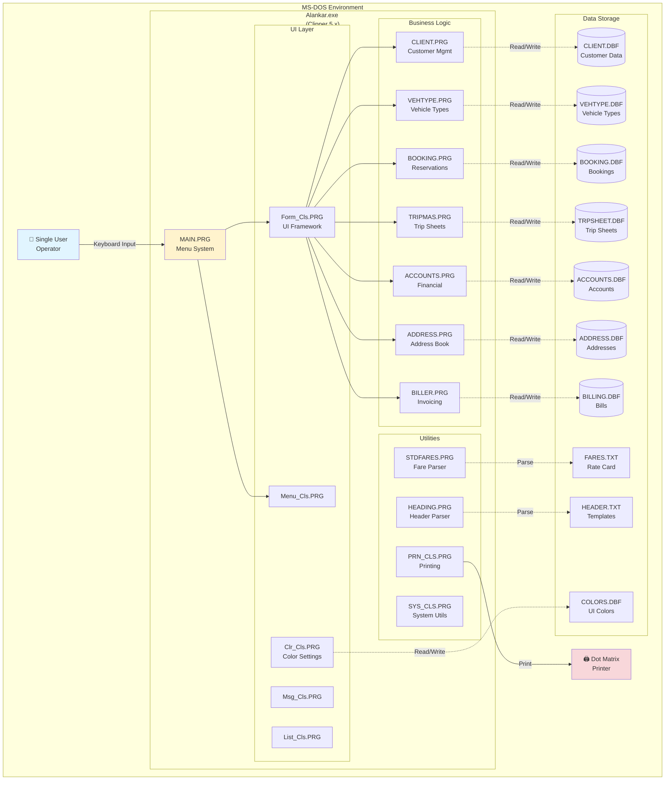
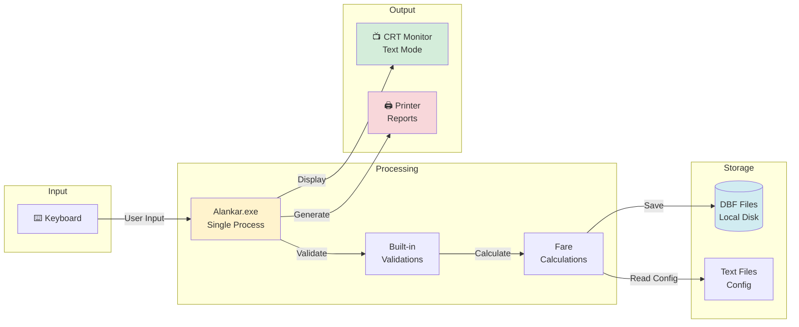
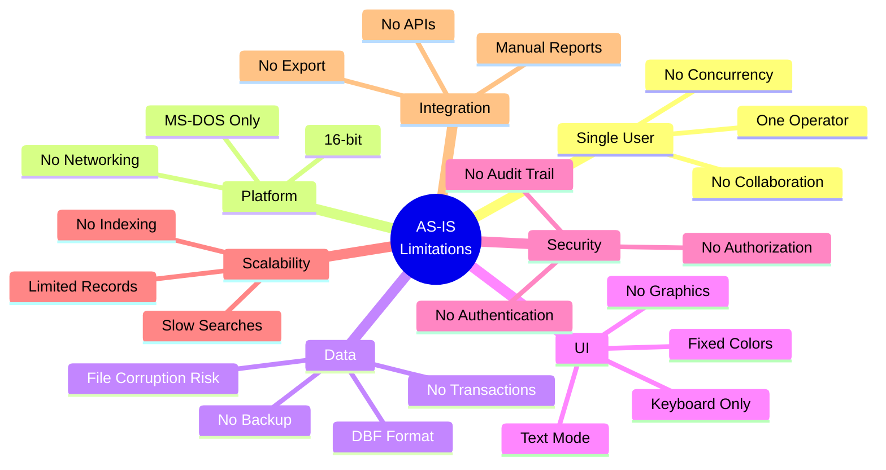
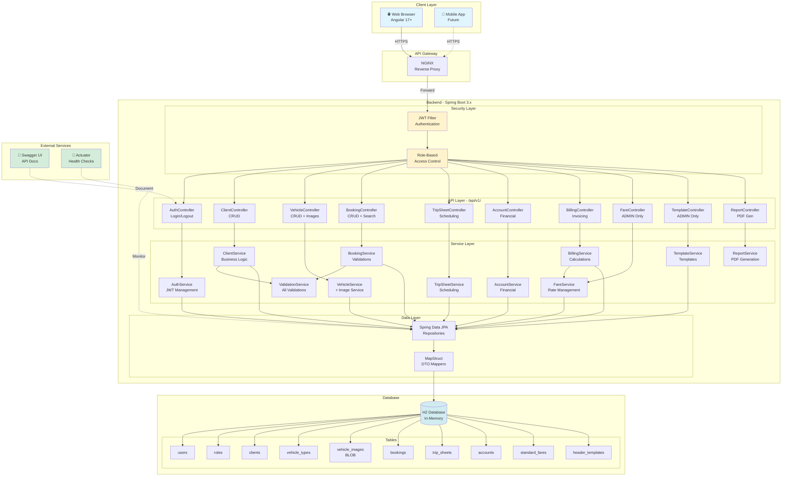
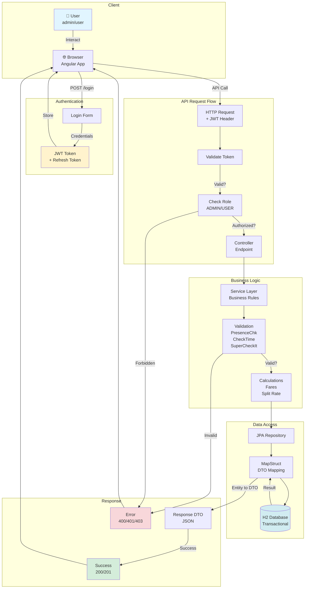
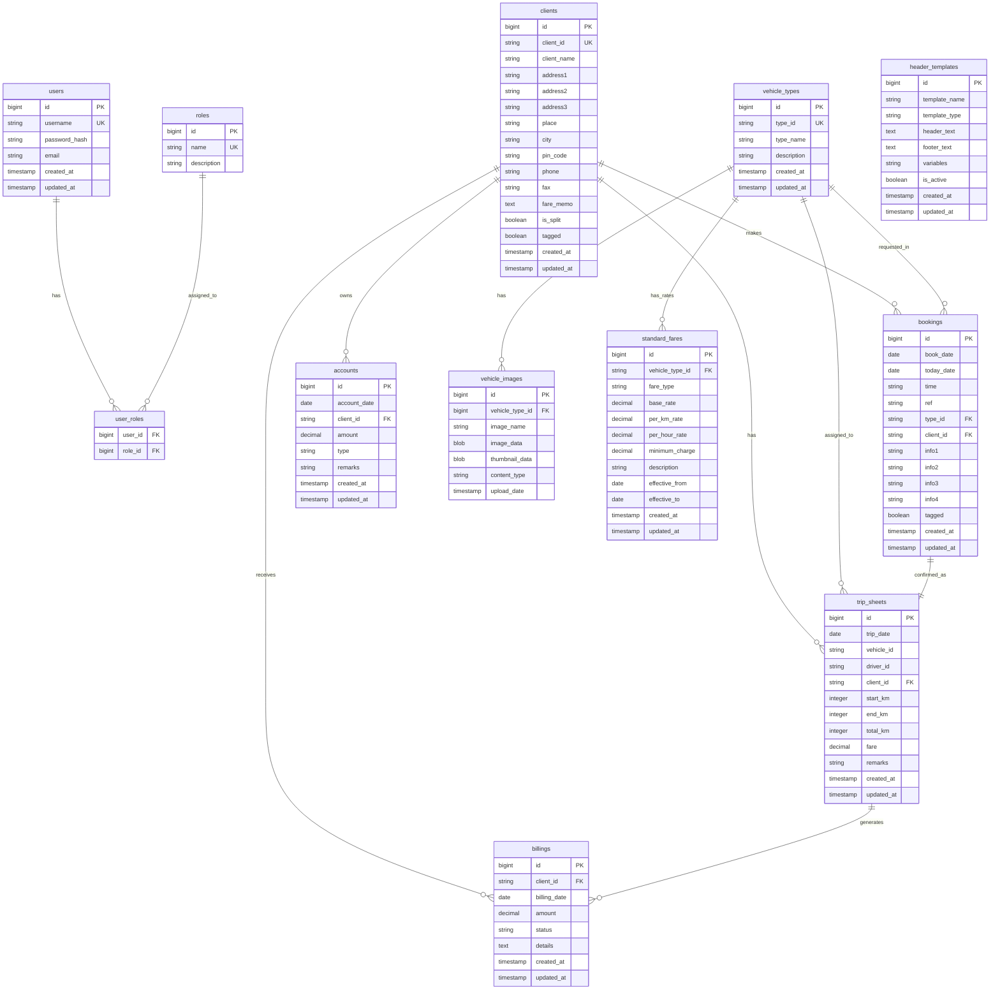
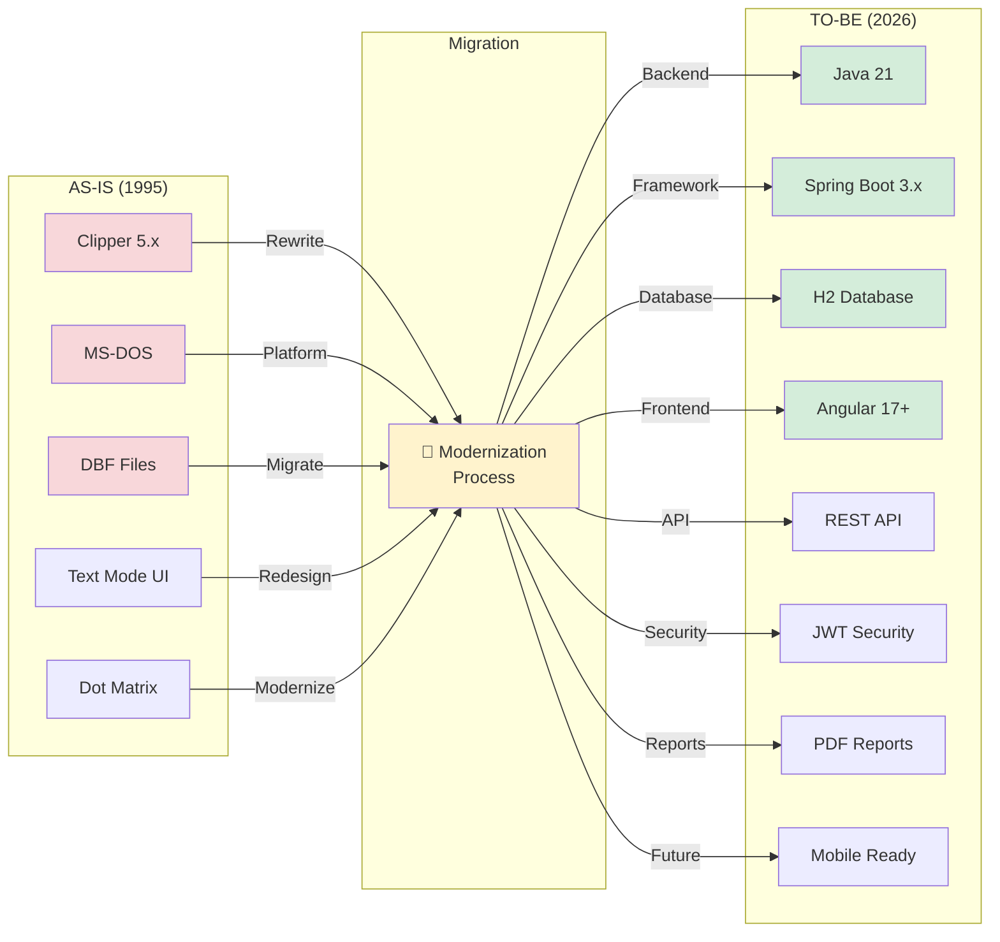
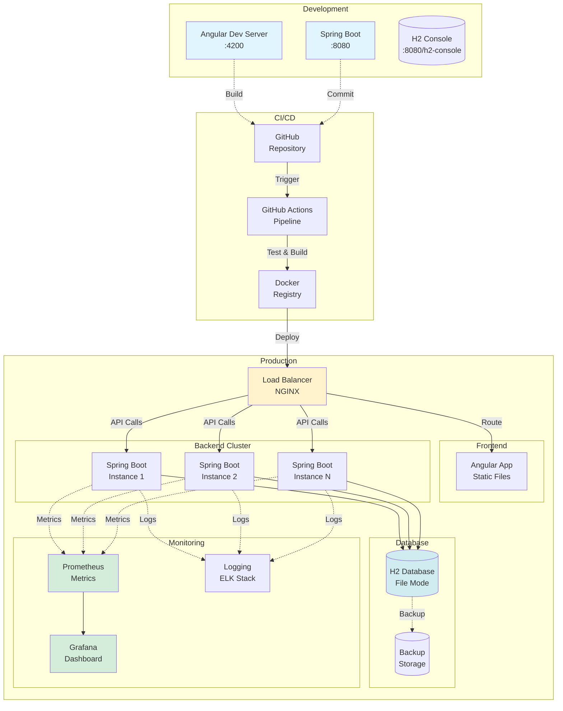

# Arhitekturni Dijagrami - AS-IS vs TO-BE

## 📊 AS-IS Arhitektura (Legacy - 1995)

### Sistemski Pregled



### Data Flow - AS-IS



### Limitations - AS-IS



---

## 🚀 TO-BE Arhitektura (Modern - 2026)

### Sistemski Pregled



### Data Flow - TO-BE



### Security Architecture

```mermaid
graph TB
    subgraph "User Access"
        ADMIN[👤 ADMIN<br/>admin/admin]
        USER[👤 USER<br/>user/user]
    end
    
    subgraph "Authentication"
        LOGIN[Login Endpoint<br/>/api/v1/auth/login]
        JWT_GEN[JWT Generator<br/>Access + Refresh]
        BCRYPT[BCrypt<br/>Password Hash]
    end
    
    subgraph "Authorization"
        JWT_FILTER[JWT Filter<br/>Validate Token]
        ROLE_CHECK[@PreAuthorize<br/>Role Check]
        
        subgraph "ADMIN Only"
            FARE_CTRL[Fare Controller]
            TEMPLATE_CTRL[Template Controller]
        end
        
        subgraph "USER + ADMIN"
            CLIENT_CTRL[Client Controller]
            VEHICLE_CTRL[Vehicle Controller]
            BOOKING_CTRL[Booking Controller]
            TRIP_CTRL[Trip Controller]
            ACCOUNT_CTRL[Account Controller]
            BILLING_CTRL[Billing Controller]
        end
    end
    
    subgraph "Database"
        USER_TABLE[(users table<br/>password_hash)]
        ROLE_TABLE[(roles table<br/>ADMIN/USER)]
    end
    
    ADMIN -->|Login| LOGIN
    USER -->|Login| LOGIN
    LOGIN --> BCRYPT
    BCRYPT -->|Verify| USER_TABLE
    USER_TABLE -->|Load Roles| ROLE_TABLE
    ROLE_TABLE --> JWT_GEN
    JWT_GEN -->|Return Token| ADMIN
    JWT_GEN -->|Return Token| USER
    
    ADMIN -->|API Request<br/>+ JWT| JWT_FILTER
    USER -->|API Request<br/>+ JWT| JWT_FILTER
    
    JWT_FILTER -->|Extract Role| ROLE_CHECK
    
    ROLE_CHECK -->|hasRole('ADMIN')| FARE_CTRL
    ROLE_CHECK -->|hasRole('ADMIN')| TEMPLATE_CTRL
    
    ROLE_CHECK -->|hasAnyRole| CLIENT_CTRL
    ROLE_CHECK -->|hasAnyRole| VEHICLE_CTRL
    ROLE_CHECK -->|hasAnyRole| BOOKING_CTRL
    ROLE_CHECK -->|hasAnyRole| TRIP_CTRL
    ROLE_CHECK -->|hasAnyRole| ACCOUNT_CTRL
    ROLE_CHECK -->|hasAnyRole| BILLING_CTRL
    
    style ADMIN fill:#fff3cd
    style USER fill:#e1f5ff
    style JWT_GEN fill:#d4edda
    style FARE_CTRL fill:#f8d7da
    style TEMPLATE_CTRL fill:#f8d7da
```

### Database Schema - TO-BE



### Technology Stack Comparison



### Deployment Architecture



---

## 📈 Comparison Summary

| Aspect | AS-IS (1995) | TO-BE (2026) |
|--------|--------------|--------------|
| **Platform** | MS-DOS | Web + Mobile |
| **Users** | Single User | Multi-User |
| **Language** | Clipper 5.x | Java 21 + TypeScript |
| **Database** | DBF Files | H2 (SQL) |
| **UI** | Text Mode | Modern Web UI |
| **Security** | None | JWT + RBAC |
| **API** | None | RESTful API |
| **Scalability** | Limited | Horizontal |
| **Backup** | Manual | Automated |
| **Testing** | Manual | Automated (80%+) |
| **Documentation** | Minimal | Swagger + Docs |
| **Mobile** | No | Ready |
| **Reports** | Dot Matrix | PDF |
| **Images** | No | Yes (BLOB) |
| **Deployment** | Manual Copy | CI/CD |
