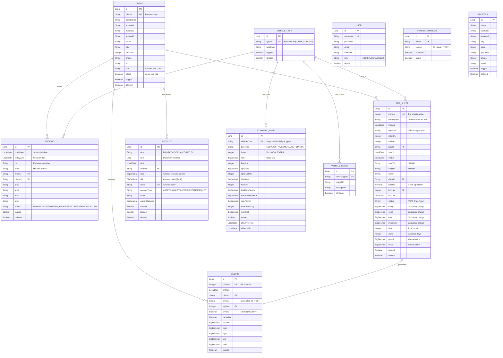
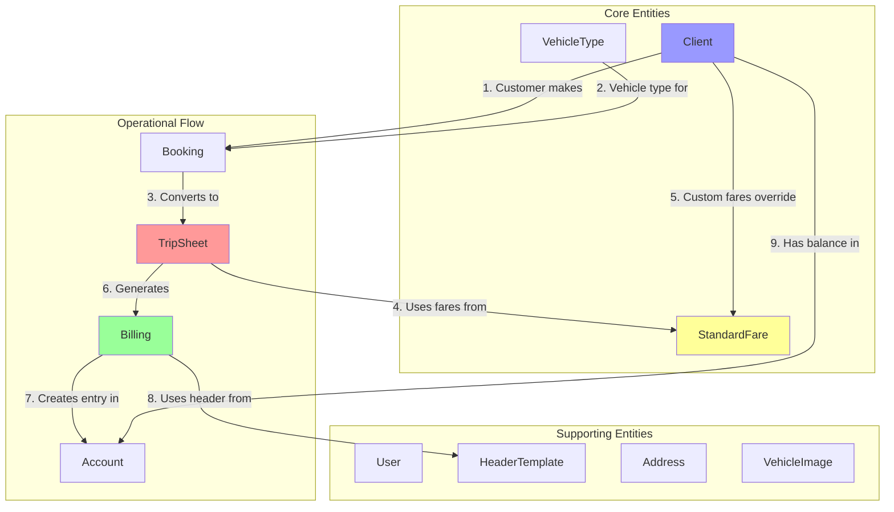

# Bob Car Rental - Data Model & Business Logic Documentation

## 📊 Entity Relationship Diagram (ERD)



## 🔄 Module Dependency Graph



## 📋 Business Logic Rules

### 1. **Client Management**

#### Rules:
- **Client ID**: Must be unique, uppercase alphanumeric (max 10 chars)
- **MISC Client**: Special client ID for one-time customers
  - When `clientId = "MISC"`, client name is stored in TripSheet/Billing
  - No address lookup for MISC clients
- **Custom Fares**: Clients can have custom fare structures stored in `fare` field (TEXT)
  - If `client.fare` is not null/empty, use custom fares
  - Otherwise, use StandardFare table
- **Split Rate**: Only clients with `isSplit = true` can use Split Rate (S) pricing
- **Soft Delete**: Clients are never physically deleted, only marked as `deleted = true`

#### Validation:
```java
// From TRIPMAS.PRG line 209
IF RTRIM(aTrpSheet:mClientId) == "MISC" .OR. UPPER(CLIENT->IsSplit) == "Y"
    // Allow Flat, Outstation, Split
ELSE   
    // Allow only Flat, Outstation
ENDIF
```

---

### 2. **Vehicle Type Management**

#### Rules:
- **Type ID**: Must be unique, uppercase alphanumeric (max 5 chars)
  - Examples: AMB (Ambulance), CON (Container), etc.
- **Images**: One vehicle type can have multiple images
- **Fares**: Each vehicle type has multiple fare entries in StandardFare table
- **Soft Delete**: Vehicle types are never physically deleted

---

### 3. **Booking → TripSheet Flow**

#### Rules:
- **Booking**: Reservation/order for future date
  - `bookDate`: When service is scheduled
  - `todayDate`: When booking was created
  - Status: PENDING → CONFIRMED → IN_PROGRESS → COMPLETED
- **TripSheet**: Actual execution record (Confirmatory Order)
  - Created from Booking or standalone
  - Contains actual KM readings, times, charges

#### Workflow:
```
1. Customer calls → Create BOOKING
2. Vehicle dispatched → Create TRIP_SHEET (from booking or new)
3. Trip completed → Calculate charges → Generate BILLING
4. Bill printed → Create ACCOUNT entry
```

---

### 4. **TripSheet Fare Calculation** ⚠️ CRITICAL

#### Status Field Meaning:
```java
// From TRIPMAS.PRG lines 136-144, 233, 272, 286
status = 'F'  // Flat Rate (local hourly)
status = 'S'  // Split Rate (hire + fuel)
status = 'O'  // Outstation (per KM + night halt)
```

**⚠️ IMPORTANT**: `status` field represents **FARE TYPE**, NOT trip completion state!

#### isBilled Field:
```java
// From TRIPMAS.PRG lines 146-150
IF aTrpSheet:mIsBilled
   @ R, C SAY "[BILLED]"      // Trip has been billed
ELSE
   @ R, C SAY "[NOT BILLED]"  // Trip not yet billed
ENDIF
```

**⚠️ CRITICAL**: `isBilled` is the boolean flag that indicates if trip is billed!

#### Fare Calculation Logic:

**A. Flat Rate (F)** - From TRIPMAS.PRG lines 269-282
```java
// LocFare(nTotTime, aFare) - finds rate based on hours
oCharge:zStatus := 'F'
oCharge:zHire   := oLoc:lBasic        // Base rate for hours
oCharge:zMin    := 0
oCharge:zHalt   := 0

nKm -= oLoc:lFreeKm                   // Subtract free KM
If nKm > 0
   oCharge:zExtra := nKm * oLoc:lKmRate  // Extra KM charge
Else
   oCharge:zExtra := 0
Endif
```

**B. Split Rate (S)** - From TRIPMAS.PRG lines 283-299
```java
oCharge:zStatus  := 'S'
oCharge:zHire    := oLoc:hBasic       // Hire charge
oCharge:zHalt    := 0

IF oLoc:hFuelKm >= nKm
    oCharge:zMin := nKm * oLoc:hKmFuel     // Normal fuel cost
    oCharge:zExtra := 0
ELSE 
    oCharge:zMin   := oLoc:hFuelKm * oLoc:hKmFuel    // Normal fuel
    oCharge:zExtra := (nKm - oLoc:hFuelKm) * oLoc:lKmRate  // Extra KM
ENDIF
```

**C. Outstation (O)** - From TRIPMAS.PRG lines 300+
```java
oCharge:zStatus := 'O'
oCharge:zHire   := 0
oCharge:zExtra  := nKm * oOut:oKmRate     // Per KM rate
oCharge:zMin    := oOut:oMinKm * oOut:oKmRate  // Minimum KM charge
oCharge:zHalt   := nDay * oOut:oHalt      // Night halt per day
```

#### Total Bill Calculation - From TRIPMAS.PRG lines 241-245
```java
nBillAmt := oCharge:zHire  + oCharge:zExtra + aTrpSheet:mMisc
nBillAmt += oCharge:zMin

IF oCharge:zStatus == "O"
   nBillAmt += aTrpSheet:mPermit + oCharge:zHalt
ENDIF
```

#### Field Mappings:
```
TripSheet Fields:
- hiring  = zHire   (Base hire charge)
- extra   = zExtra  (Extra KM charge)
- halt    = zHalt   (Night halt charge)
- minimum = zMin    (Minimum/fuel charge)
- permit  = Manual entry (permit charges)
- misc    = Manual entry (parking, etc.)
- time    = Total hours calculated
- days    = Calendar days (endDt - startDt + 1)
```

---

### 5. **Billing Generation** ⚠️ CRITICAL

#### Rules from BILLER.PRG:

**A. Billing Creation** - From TRIPMAS.PRG line 246
```java
// Called after TripSheet is saved with calculated charges
Biller(aTrpSheet:mBillNum, nDate, aTrpSheet:mClientId, nBillAmt, nMode)
```

**B. Bill Number Validation** - From TRIPMAS.PRG lines 193-194
```java
// BillChk(oGet:Buffer) - validates bill number doesn't exist
// Only checked on INSERT mode
@ R+15, C SAY "Bill Number   : " GET aTrpSheet:mBillNum WHEN nMode=="Insert";
         VALID { |oGet| BillChk(oGet:Buffer)} PICTURE "999999"
```

**C. Billing Status** - From BILLER.PRG lines 88-90, 136-140, 428-430
```java
// Bill image generated on first view
IF BILLING->Printed == .F.
   Write()  // Generate bill image
ENDIF

// Print status
IF BILLING->Printed
   @ R++, 03 SAY "COPY"
ELSE
   @ R++, 03 SAY "ORIGINAL"
ENDIF

// After printing
IF BILLING->Printed == .F.
   BILLING->PRINTED := .T.
ENDIF
```

**D. Bill Cancellation** - From BILLER.PRG lines 473-483
```java
// Cancelled bills create ACCOUNT entry
IF nChoice == 1
    OpenDatabase("ACCOUNTS")
    DBAPPEND()    
    ACCOUNTS->ClientId  := aBill:ClientId
    ACCOUNTS->Date      := aBill:Date
    ACCOUNTS->Desc      := "CANCELLED BILL"
    ACCOUNTS->Num       := STR(aBill:Num)
    ACCOUNTS->Recd      := aBill:Amt  // Credit entry
    CloseDatabase("ACCOUNTS")
    
    BILLING->Cancelled := .T.
ENDIF
```

#### Validation Rules:

**⚠️ CORRECT Validation** (from original code):
```java
// TripSheet can be billed if:
// 1. It exists (trpNum is valid)
// 2. It's not already billed (isBilled = false)
// 3. Bill number doesn't already exist (for new bills)

// WRONG validation (was in BillingServiceImpl):
if (!"FINISHED".equals(tripSheet.getStatus())) {
    throw new ValidationException("Cannot create billing for non-finished trip sheet");
}

// CORRECT validation (should be):
if (tripSheet.getIsBilled()) {
    throw new ValidationException("Trip sheet is already billed");
}
```

---

### 6. **Account Entries**

#### Rules from BILLER.PRG and ACCOUNTS:

**A. Entry Types**:
```java
desc = "BILL"            // Debit entry (bill field)
desc = "PAYMENT"         // Credit entry (recd field)
desc = "CANCELLED BILL"  // Credit entry (recd field)
```

**B. Balance Calculation**:
```java
// Balance = Sum(bill) - Sum(recd)
// Positive balance = Customer owes money
// Negative balance = Credit balance
```

**C. Bill Cancellation Flow**:
```
1. User cancels bill in BILLING module
2. System creates ACCOUNT entry:
   - desc = "CANCELLED BILL"
   - recd = billAmt (credit)
   - num = billNum
3. BILLING.cancelled = true
4. Bill is never deleted, only marked cancelled
```

---

### 7. **StandardFare Structure**

#### Fare Types:

**A. LOCAL** - Hourly rates with free KM
```
hours | rate | freeKm | kmRate
------|------|--------|-------
4     | 500  | 40     | 8
8     | 900  | 80     | 8
12    | 1200 | 120    | 8
```

**B. EXTRA** - Additional hour rates
```
hours | rate | freeKm | kmRate | hireRate | hireKm
------|------|--------|--------|----------|-------
1     | 150  | 10     | 8      | 100      | 10
2     | 280  | 20     | 8      | 180      | 20
```

**C. GENERAL** - Fuel and excess KM rates
```
fuelRatePerKm | ratePerExcessKm
--------------|----------------
5.50          | 8.00
```

**D. OUTSTATION** - Per KM with minimum
```
ratePerKm | minKmPerDay | nightHalt
----------|-------------|----------
12.00     | 250         | 300
```

---

### 8. **Data Integrity Rules**

#### Referential Integrity:
```
1. TripSheet.clientId → Client.clientId (or "MISC")
2. TripSheet.typeId → VehicleType.typeId
3. TripSheet.billNum → Billing.billNum (1:1)
4. Billing.trpNum → TripSheet.trpNum (1:1)
5. Billing.clientId → Client.clientId (or "MISC")
6. Account.clientId → Client.clientId (or "MISC")
7. StandardFare.vehicleCode → VehicleType.typeId
```

#### Business Constraints:
```
1. TripSheet.startKm <= TripSheet.endKm
2. TripSheet.startDt <= TripSheet.endDt
3. TripSheet.startTm and endTm in HH:MM format (00:00-24:59)
4. TripSheet.status in ('F', 'S', 'O')
5. TripSheet.isBilled = true → billNum must exist
6. Billing.trpNum must be unique (1:1 relationship)
7. Billing.cancelled = true → Cannot be un-cancelled
8. Client.isSplit = false → Cannot use status = 'S'
```

---

### 9. **Soft Delete Pattern**

All entities use soft delete:
```java
// Never physically delete records
entity.deleted = true

// Filter in queries
WHERE deleted = false OR deleted IS NULL
```

---

### 10. **Tagged Feature**

Legacy feature for filtering/reporting:
```java
// User can "tag" records for batch operations
entity.tagged = true

// Examples:
// - Print all tagged bills
// - Export tagged trip sheets
// - Calculate totals for tagged records
```

---

## 🔍 Critical Business Logic Summary

### TripSheet → Billing Workflow:

```
1. Create TripSheet
   ├─ Enter basic info (client, vehicle, dates, KM)
   ├─ System asks: Flat/Split/Outstation?
   ├─ System calculates charges based on StandardFare
   ├─ User enters permit, misc charges
   └─ System saves with status='F'/'S'/'O', isBilled=false

2. Generate Billing
   ├─ Check: isBilled must be false
   ├─ Check: billNum must not exist (for new bills)
   ├─ Create Billing record
   │  ├─ billNum (unique)
   │  ├─ billDate
   │  ├─ clientId (from TripSheet)
   │  ├─ trpNum (from TripSheet)
   │  ├─ billAmt (calculated total)
   │  └─ printed = false
   ├─ Update TripSheet
   │  ├─ isBilled = true
   │  ├─ billNum = new bill number
   │  └─ billDate = billing date
   └─ Create Account entry (desc="BILL", bill=billAmt)

3. Print Bill
   ├─ Generate billImg (text format) if not exists
   ├─ Print: "ORIGINAL" if printed=false, "COPY" if printed=true
   └─ Set printed = true after first print

4. Cancel Bill (if needed)
   ├─ Set Billing.cancelled = true
   ├─ Create Account entry (desc="CANCELLED BILL", recd=billAmt)
   └─ Bill remains in database, never deleted
```

### Key Validation Points:

```java
// ✅ CORRECT validations:
1. TripSheet.isBilled == false (to create billing)
2. Billing.billNum must be unique
3. TripSheet.status in ('F', 'S', 'O') - fare type
4. Client.isSplit == true (to use status='S')
5. TripSheet.startKm <= endKm
6. TripSheet.startDt <= endDt

// ❌ WRONG validations:
1. TripSheet.status == "FINISHED" (status is fare type, not completion state!)
2. Checking trip completion (legacy system has no completion workflow)
```

---

## 📝 Notes

1. **Legacy System Behavior**: The original Clipper/FoxPro system had no concept of "trip completion status". Trips were either billed or not billed.

2. **Status Field Confusion**: The `status` field in TripSheet represents **fare calculation type** (F/S/O), NOT trip state (pending/completed).

3. **MISC Client**: Special handling for one-time customers who don't need full client records.

4. **Bill Generation**: Bills are generated automatically when TripSheet is saved, with charges calculated based on fare type and StandardFare table.

5. **No Deletion**: Legacy system never deleted records, only marked them as deleted/cancelled for audit trail.

6. **Account Entries**: Every bill and payment creates an account entry for balance tracking.

---

*Generated from legacy Clipper code analysis and Java entity models*
*Last updated: 2026-03-29*